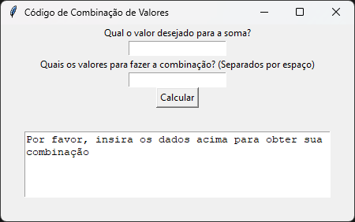
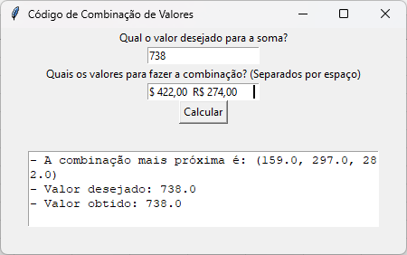

# Problema de Negócio

Este projeto visa solucionar uma demanda do setor financeiro de uma empresa, identificando a combinação de valores menores que resulta em uma determinada soma. A problemática residia na discrepância entre as transações menores controladas internamente e as notas fiscais emitidas pelo banco, que agregavam os valores sem fornecer a combinação usada.

Essa falta de detalhes prejudicava a comunicação entre o setor financeiro e a contabilidade. A implementação deste projeto permitirá ao setor financeiro discernir os valores individuais contidos em cada nota fiscal, otimizando a comunicação com a contabilidade.

## Premissas Assumidas

- Financeiro realiza controle interno através do Excel ou Google Sheets.
- Valores foram formatados com base na moeda brasileira (R$).
- Usuário irá apenas copiar os valores da planilha e colar no programa.
- Baixa quantidade de números inseridos (cerca de 15 números).

## Solução Utilizada

O código utilizado percorre todas as combinações possíveis de uma lista números informados, armazenando a combinação de valores que mais se apoxima do resultado desejado. Além de informar qual a combinação de valores, o programa informa qual era o valor desejado e qual o valor mais próximo que conseguiu-se obter de acordo com os números fornecidos.

## Produto Final do Projeto

Arquivo executável que pode ser utilizado sem a necessidade de instalar Python.

- Página incial:

- Exemplo de resultado:

## Como Utilizar

Na pasta "Codigo e Executavel", localize o arquivo "combinacoes_valores.exe" e realize o download.

Irá aparecer um aviso que o programa pode ser malicioso, mas o meu código e o [código oficial do Pyinstaller](https://github.com/pyinstaller/pyinstaller) estão disponíveis publicamente na internet, então pode ficar tranquilo.

Este aviso ocorre porque pessoas maliciosas na internet podem utilizar o Pyinstaller para distribuir malwares, então os antivírus disparam esse aviso, mas, neste caso, você pode baixar o arquivo e utilizá-lo tranquilamente. As fontes sobre este assunto estão disponíveis aqui abaixo:

- [Github | Pyinstaller | Issues](https://github.com/pyinstaller/pyinstaller/issues/5492)
- [Stackoverflow | Program made with PyInstaller now seen as a Trojan Horse by AVG](https://stackoverflow.com/questions/43777106/program-made-with-pyinstaller-now-seen-as-a-trojan-horse-by-avg)

## Conclusão

A partir da utilização dese programa, o setor financeiro pode obter a informação que deseja de forma simples e objetiva, aumentando a produtividade e assertividade do seu trabalho, garantindo uma boa comunicação com o time de contabilidade.

## Próximos Passos

- Melhorar visual do programa.
- Utilizar algoritmos mais performáticos para maiores quantidades de números.
